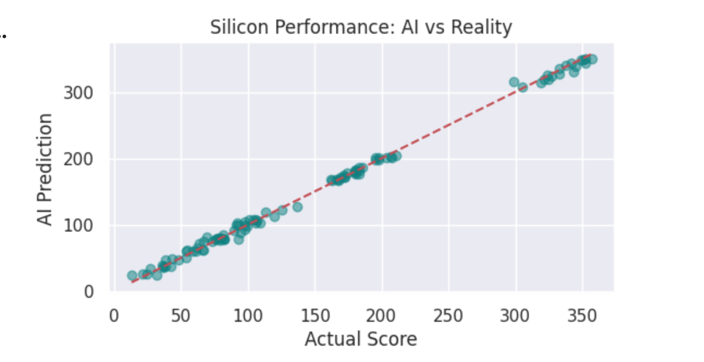

#Silicon Performance Predictor

This project provides a post-silicon characterization pipeline designed to model the relationship between Process, Voltage, and Temperature (PVT) and hardware performance metrics. Using synthetic data generation based on physical semiconductor models, the script trains a Machine Learning model to predict power consumption and maximum operating frequency ($F_{max}$).

Technical Overview

The script simulates characterization data for 1,200 silicon samples, modeling two primary hardware outputs:

Power Consumption (power_w): Modeled as a function of dynamic power ($V^2$) and exponential leakage based on temperature and process corners.

Maximum Frequency (fmax_ghz): Modeled based on voltage scaling, process speed, and thermal throttling.

Features

PVT Simulation: Generates data across Slow (0), Typical (1), and Fast (2) process corners.

Physical Modeling: Accounts for leff_nm (Effective Channel Length) and junction temperature impacts.

Machine Learning: Utilizes a RandomForestRegressor (150 estimators) for multi-output regression.

Validation: Produces an engineering report visualization to verify model performance against physical truths.

Data Schema

The generated dataset (df) contains the following features:

Feature

Description

process_corner

Manufacturing variation (0: Slow, 1: Typical, 2: Fast)

vdd_voltage

Supply Voltage (0.65V - 1.2V)

temp_celsius

Junction Temperature (-40°C to 125°C)

leff_nm

Effective Channel Length (centered at 7nm)

power_w

Target: Total Power (Watts)

fmax_ghz

Target: Maximum Frequency (GHz)

Execution and Outputs

To run the pipeline, execute the script:

python silicon_performance_predictor.py

1. Model Analytics

The script prints the $R^2$ Accuracy Score and Mean Absolute Error (MAE) to the console to evaluate the predictive quality of the Random Forest model.

2. Engineering Visualizations

The script generates silicon_performance_report.png, which includes:

Voltage vs. Power: A scatter plot showing the quadratic power scaling across different process corners.

Actual vs. Predicted Fmax: A correlation plot to validate the model's accuracy in predicting silicon speed.

